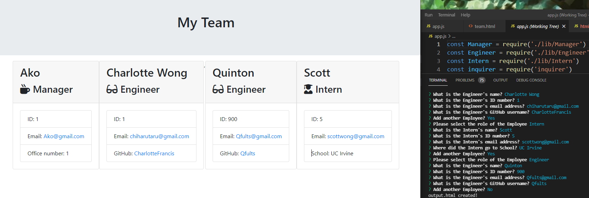

# Employee Template
---

## Table of Contents
[Description](#description)
[Installation](#installation)
[Usage](#usage)
[License](#license)
[Contributing](#contributing)
[Tests](#tests)
[Questions](#questions)

---
## Description
Employee Template is a command line input program that allows a user to input data about managers, engineers, and interns. The data will be output to a .html file once all the prompts are complete. It is programmed in object oriented JavaScript and uses inquirer, fs, and path npms.

Here is an image of the application in use:

---
## Installation
To install this program, clone down the repository from GitHub and then type 'npm init -y' followed by 'npm i' in the terminal.

---
## Usage
To use this program type node app.js in the terminal after installing, keep in mind this will not work if your machine does not have node.

---
## License
None

---
## Contributing
If you'd like to contribute to this project then feel free to clone the repository and make your own branch.

---
## Tests
If you want to run some tests on this repository you may do so through jest, there are already some pre built in tests for the classes here. 

---
## Questions
Created by: CharlotteFrancis on GitHub.
[GitHub Profile Link](github.com/CharlotteFrancis)
Contact me at ChiharuTaru@gmail.com if you have any further questions.
